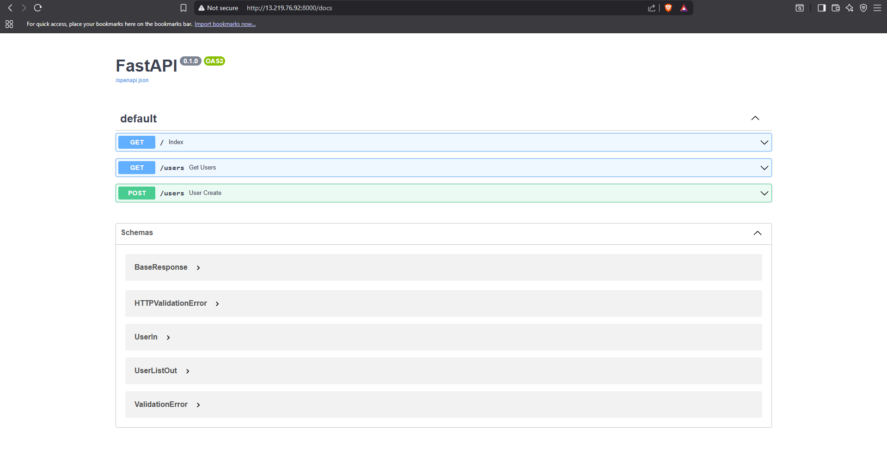

# Dockerized FastAPI Application

This project provides a solution for a machine test to dockerize a simple FastAPI application. The application exposes a few endpoints to interact with a JSON file, and the entire setup can be managed using Docker Compose.

---

## 🚀 Project Overview

The goal was to containerize a basic FastAPI application and ensure it can be run and managed with `docker-compose`. A key requirement was to persist user data in a `users.json` file, even after the containers are shut down and restarted.

---

## 🛠️ Technology Stack

* **FastAPI**: A modern, fast (high-performance) web framework for building APIs with Python 3.7+.
* **Docker**: A platform for developing, shipping, and running applications in containers.
* **Docker Compose**: A tool for defining and running multi-container Docker applications.

---

## 📂 Project Structure

```

.
├── app/
│   ├── main.py
│   └── users.json
├── data/
│   └── users.json
├── docker-compose.yml
├── Dockerfile
├── images/
│   ├── docker compse down and up.png
│   ├── fast api.png
│   ├── hello message.png
│   ├── user data after compose up and down.png
│   └── user data.png
└── requirements.txt

````

---

## 📋 How to Run the Application

### Prerequisites

* **Docker**: Ensure Docker is installed on your system.
* **Docker Compose**: Ensure Docker Compose is installed.

### Steps

1.  Clone this repository to your local machine:
    ```bash
    git clone [https://github.com/govindkotalwar8/docker-fastapi-test.git](https://github.com/govindkotalwar8/docker-fastapi-test.git)
    cd docker-fastapi-test
    ```

2.  Build and run the containers using Docker Compose:
    ```bash
    docker-compose up --build
    ```
    This command will build the Docker image and start the FastAPI application in a container. The `-d` flag can be used to run in detached mode (`docker-compose up -d`).

3.  The application will be accessible at `http://localhost:8000`. You can test the API endpoints using the interactive documentation at `http://localhost:8000/docs`.

---

## 🎯 API Endpoints

The application provides the following endpoints:

| Method | Endpoint | Description |
| :--- | :--- | :--- |
| **GET** | `/` | Returns a simple "Hello" message. |
| **GET** | `/users` | Returns a list of users stored in the `data/users.json` file. |
| **POST** | `/users` | Accepts new user data and appends it to the `data/users.json` file. |

---

## 📸 Screenshots

To demonstrate the application's functionality and persistence, here are screenshots showing key steps.

### Initial API Access (`/docs`)
This shows the interactive API documentation provided by FastAPI.


### The "Hello" Message Endpoint
A successful response from the root endpoint.


### Adding a User
A screenshot showing data being posted to the `/users` endpoint.


### Data Persistence After Restart
This screenshot proves that the user data is correctly stored and persists even after the container is shut down and brought back up, fulfilling a key project requirement.


---

## ✅ Task Completion

* **Application Containerization**: The FastAPI application is successfully containerized using a `Dockerfile`.
* **Docker Compose Integration**: A `docker-compose.yml` file is provided to orchestrate the application and its dependencies.
* **Data Persistence**: The `users.json` file is correctly mounted as a volume, ensuring that user data is not lost when the container is stopped or restarted. This is verified by the screenshot of data persisting after a `docker-compose down` and `up` cycle.

---

<br>

_This project was completed as part of a machine test for Nimap Infotech._
````



